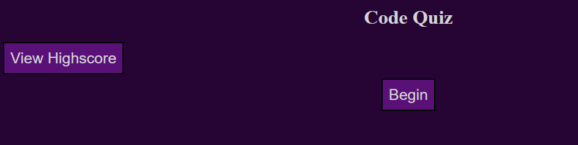
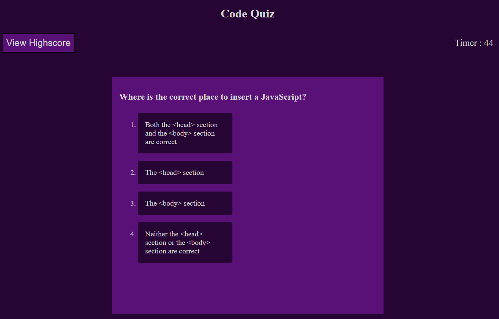

# code-quiz
---

## Description 

### [Deployed Link](https://maverickwong17.github.io/code-quiz/).

This is a deployment of a quiz like application. It contains 5 multiple choice questions related to javascript to help reinforce those concepts along with using js and its inbuilt web api to dynamically change the webpage. (screenshots below)

## Table of Contents (Optional)

If your README is very long, add a table of contents to make it easy for users to find what they need.

* [Installation](#installation)
* [Usage](#usage)
* [Credits](#credits)
* [License](#license)

## Installation

Clone repository and run on local machine or use deployed link above

## Usage 

The use is to help reinforce javascript concepts and syntax. The viewport dynamically changes between different elements and stages of  the quiz.

Page on startup

Quiz section with dynamic size for pick options and timer

Scoreboard to keep track of users locally, with the ability to clear the scoreboard

## Credits

[w3 Schools](https://www.w3schools.com/)

[CSS Tricks](https://css-tricks.com/).

## License

MIT License

## Technologies Used

HTML, CSS, and Javascript

