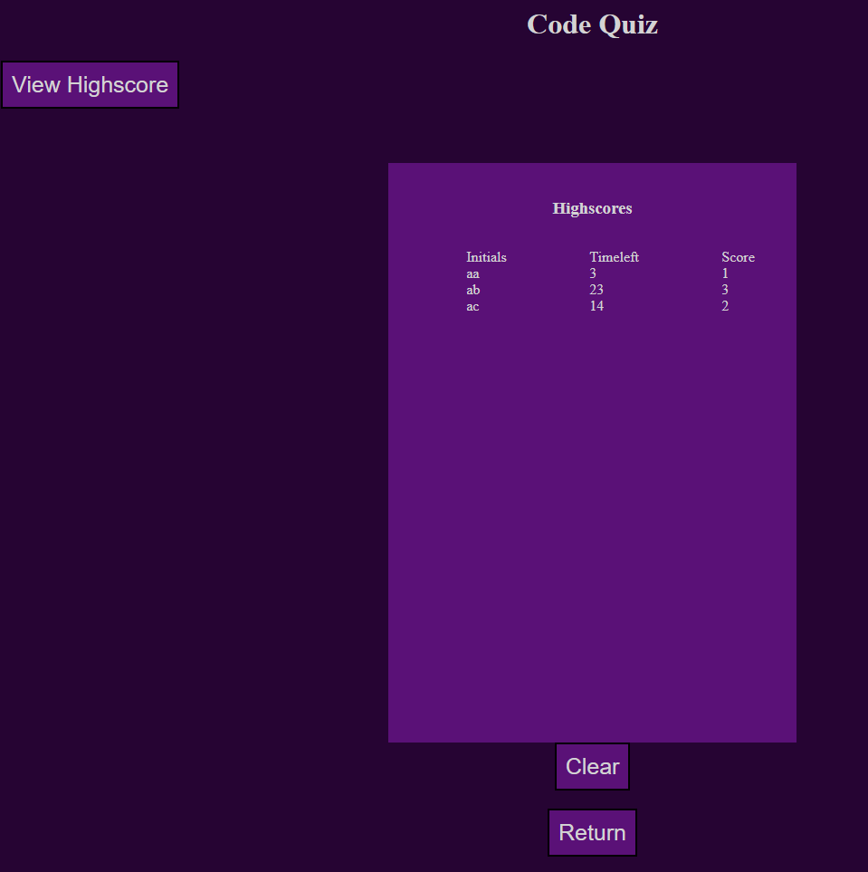

# code-quiz
---

## Description 

### [Deployed Link](https://maverickwong17.github.io/code-quiz/).

This is a deployment of a quiz like application. It contains 5 multiple choice questions related to javascript to help reinforce those concepts along with using js and its inbuilt web api to dynamically change the webpage. (screenshots below)

## Table of Contents (Optional)

If your README is very long, add a table of contents to make it easy for users to find what they need.

* [Installation](#installation)
* [Usage](#usage)
* [Credits](#credits)
* [License](#license)


## Installation

Clone repository and run on local machine or use deployed link above


## Usage 

Provide instructions and examples for use. Include screenshots as needed. 

To add a screenshot, create an `assets/images` folder in your repository and upload your screenshot to it. Then, using the relative filepath, add it to your README using the following syntax:

```md

```


## Credits

[w3 Schools](https://www.w3schools.com/)

[CSS Tricks](https://css-tricks.com/).

## License

MIT License


## Features

Scoreboard to keep track of users
